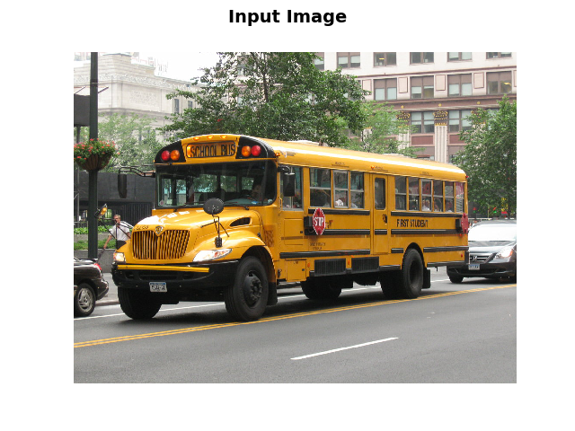
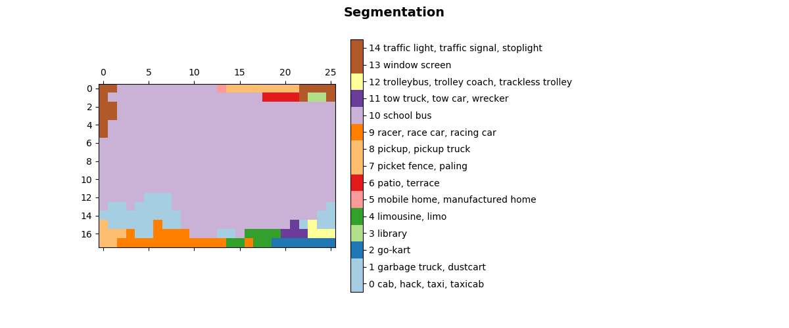

# tensorflow-slim-segmentation

Runs under Python 3.5 and TensorFlow 1.6+

## Quick Start

1. If you don't already have it, git clone [TensorFlow models](https://github.com/tensorflow/tensorflow).
2. Copy the datasets and preprocessing folders over from models/reasearch/slim
into the directory with segmentation_vgg_16.py etc.
3. Create a directory called slim_pretained and download and unpack
vgg_16.ckpt and vgg_19.ckpt into it. A table of checkpoints locations can be found in the
[slim README Pre-Trained Models section](https://github.com/tensorflow/models/blob/master/research/slim/README.md).
For example [vgg_16_2016_08_28.tar.gz](http://download.tensorflow.org/models/vgg_16_2016_08_28.tar.gz), and
[vgg_19_2016_08_28.tar.gz](http://download.tensorflow.org/models/vgg_19_2016_08_28.tar.gz) are the download locations.
4. Run segmentation_vgg_16.py

